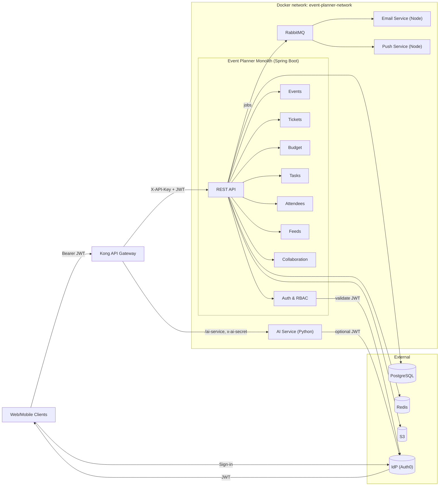

# Architecture

## Overview

The Event Planner backend (sade-mono) is a **Java Spring Boot monolith** that provides REST APIs for event planning, ticketing, attendees, budgets, timelines, feeds, and notifications. It runs behind **Kong** as the API gateway, with separate services for **AI** (Python/FastAPI), **email** (Node/Resend), and **push notifications** (Node/Firebase). Persistence is **PostgreSQL**; schema can be managed by **Flyway** migrations or, for initial setup, Hibernate DDL. **Redis** is used for caching. The front end and mobile clients authenticate via **OIDC (e.g. Auth0)** and send a Bearer JWT on each request.

---

## Tech stack

| Layer | Technology |
|-------|------------|
| Gateway | Kong 3.x (declarative config in `infra/kong/kong.yml`) |
| API | Java 17+, Spring Boot 3, Spring Security 6, OAuth2 Resource Server (JWT) |
| Auth | OIDC (e.g. Auth0: issuer, JWKS, audience) |
| Database | PostgreSQL (Hibernate + optional Flyway; `ddl-auto` configurable) |
| Cache | Redis (Lettuce client; also Caffeine in-process for some caches) |
| Queue | RabbitMQ (email and push jobs) |
| Storage | S3-compatible (MinIO locally; AWS S3 in production — event media, user assets) |
| AI | Python FastAPI (OpenAI for event cover image generation) |
| Email | Node + Resend (React Email templates) |
| Push | Node + Firebase Cloud Messaging |

---

## Ports and URLs

| Component | Port(s) | Notes |
|-----------|---------|--------|
| **Kong (proxy)** | 8000 (HTTP), 8443 (HTTPS) | Client-facing; all API traffic should go here. |
| **Kong Admin** | 8001 | Bound to 127.0.0.1 only in container; not published in `docker-compose`. |
| **Monolith (Spring Boot)** | 8080 | Internal; exposed only within Docker network. |
| **AI service** | 8000 (internal) | Exposed as `/ai-service` via Kong; path stripped. |
| **RabbitMQ** | 5672 (AMQP), 15672 (Management UI) | Used by email and push workers. |
| **MinIO** | 9000 (API), 9001 (Console) | S3-compatible storage when running via Docker. |

- **Base URL for clients:** `http://localhost:8000` (or your deployed host). Monolith APIs live under `/api/v1/`; AI under `/ai-service/`.
- **Direct monolith (dev only):** `http://localhost:8080` when running the JAR locally; bypasses Kong (service key may still be required depending on config).

---

## High-level diagram

---

## Features and modules

- **Auth & users** — OIDC JWT validation, user provisioning (optional auto-provision from JWT), profile, settings, locations, device tokens. Signup requires verified email in the token; account linking rules prevent hijack.
- **Events** — CRUD, status, visibility, access type (open, RSVP, invite-only, ticketed), venue (embedded or linked), reminders, notification settings, stored objects (media), waitlist.
- **Collaboration** — Event members (`event_users`), roles (`event_roles` by role name), per-member permissions (`event_user_permissions`), collaborator invites (accept by token in POST body).
- **Attendees** — Registration, RSVP, check-in, invites. Invite acceptance by token is **POST only** (body); email links use fragment so the token is not in the URL.
- **Tickets** — Ticket types, price tiers, promotions, dependencies, checkouts, issuance, validation, waitlist, approval requests.
- **Budget** — One budget per event, categories, line items, revenue tracking.
- **Timeline** — Tasks and checklists (no separate “timeline” entity); event has timeline publication state.
- **Feeds** — Event posts, comments, likes.
- **Communications** — Email and push via RabbitMQ; templates and payload validation in workers; communication records stored with redacted content.
- **AI** — Cover image generation (OpenAI); gateway secret or JWT; allowlisted image fetch URLs.

---

## API surface (main resource paths)

All monolith REST APIs are versioned under **`/api/v1/`**. The following are the main controller base paths (details in [api-overview.md](api-overview.md)):

| Base path | Purpose |
|-----------|---------|
| `/api/v1/auth` | Auth info, signup, logout, profile image |
| `/api/v1/auth/users` | User management (admin/self) |
| `/api/v1/users/me/preferences` | User preferences |
| `/api/v1/users` | User follow (social), user-related endpoints |
| `/api/v1/events` | Event CRUD, media, reminders, notification settings, waitlist, feeds (posts, comments, likes), collaboration |
| `/api/v1/events/{eventId}/budget` | Budget, categories, line items |
| `/api/v1/events/{eventId}/tasks` | Timeline tasks |
| `/api/v1/events/{eventId}/ticket-types` | Ticket types |
| `/api/v1/events/{eventId}/tickets/checkout` | Checkout sessions |
| `/api/v1/events/{eventId}/tickets` | Ticket requests, validation |
| `/api/v1/attendees` | Attendees, invites, RSVP, check-in, QR codes |
| `/api/v1/tickets` | Ticket wallet, ticket operations |
| `/api/v1/ticket-type-templates` | User-level ticket type templates |
| `/api/v1/venues` | Venues |
| `/api/v1/currencies` | Currencies (e.g. for budget) |
| `/api/v1/push-notifications` | Device token registration |
| `/api/v1/collaborator-invites` | Incoming invites, accept/decline (also under events) |
| `/tasks/{taskId}/checklist` | Checklist items for a task |

- **OpenAPI:** Swagger UI at `/swagger-ui`, API docs at `/v3/api-docs` (when accessed via monolith; in production often behind same base URL as gateway).
- **Actuator:** Health, info, metrics, Prometheus, circuit breakers, retry at `/actuator/*`.

---

## Request flow

1. **Clients** sign in with the IdP (e.g. Auth0) and receive a JWT. They call Kong (e.g. `:8000` or `:8443`) with `Authorization: Bearer <token>`.
2. **Kong** adds the gateway key (`X-API-Key` for the monolith, `x-ai-secret` for the AI service), applies CORS, request-size limits, correlation ID, and routes `/` to the monolith and `/ai-service` to the AI service. Kong Admin (8001) is not exposed by default.
3. **Monolith** — `ServiceApiKeyFilter` ensures either a valid Bearer JWT (user request) or a valid `X-API-Key` (and for service-role paths, the key is required). JWT is validated with OIDC JWKS. RBAC is enforced per endpoint via `@RequiresPermission` and `RBAC_policy.yml`.
4. **AI service** — Accepts requests with a valid gateway secret (constant-time compare) or, when configured, a valid OIDC JWT. Image generation and fetch use allowlisted URLs and timeouts.
5. **Email / push** — Monolith publishes jobs to RabbitMQ; Node workers consume, validate payload (recipient count, lengths, formats), and send. Push batch size is capped (e.g. 500 tokens per message).

---

## Data flow and persistence

- **Single `application.yml`** — No profile-specific YAML for core behaviour. All config lives in `src/main/resources/application.yml`; overrides via environment variables (e.g. `SPRING_DATASOURCE_URL`, `OIDC_ISSUER_URI`).
- **Schema** — When using Flyway, migrations live under `src/main/resources/db/migration/`. Hibernate can be set to `validate` so it does not create or alter tables. For initial setup, the project may use `ddl-auto: create` once (see `.env.example` and scripts), then switch to `validate` or rely on Flyway.
- **Domain model** — See [Entity-relationship diagram](er-diagram.md). Main aggregates: users (`auth_users`, `user_settings`, `locations`), events (`events`, `venues`), collaboration (`event_users`, `event_roles`, `event_user_permissions`, `event_collaborator_invites`), attendees (`attendees`, `attendee_invites`, `attendee_rsvp_history`), tickets (types, checkouts, tickets, waitlist, approval requests), budget (budgets, categories, line items), timeline (tasks, checklists), feeds (event_posts, post_comments, post_likes), and communications (device_tokens, communications).

---

## Resilience and fault tolerance

- **Resilience4j** (configured in `application.yml`):
  - **Circuit breakers:** `notificationService`, `emailService`, `s3Service`. On repeated failures (e.g. notification/email/AMQP/IO), the circuit opens and fails fast; after a wait duration it moves to half-open and allows a few test calls.
  - **Retry:** Retry with exponential backoff for notification, email, S3 upload, and connection timeouts; ignores non-retryable exceptions (e.g. `BadRequestException`).
- **RabbitMQ:** Email and push workers use prefetch, reconnect, and optional requeue-on-error; monolith publishes with exchange/routing keys as configured.
- **Database:** HikariCP connection pool (max pool size, timeouts, idle/max lifetime) configured in `application.yml`.
- **Redis:** Lettuce pool settings; used for caching and optionally session/rate data.

---

## Observability

- **Actuator endpoints** (exposed: health, info, metrics, prometheus, circuitbreakers, retry):
  - **Health:** `/actuator/health` — includes DB, Redis, and custom components; `show-details` configurable.
  - **Metrics:** `/actuator/metrics` — application and JVM metrics.
  - **Prometheus:** `/actuator/prometheus` — scrape-friendly format for notification and email metrics (e.g. `notification.send`, `email.send`).
- **Logging:** Log levels and pattern configured in `application.yml` (e.g. `ai.eventplanner`, Spring Security, Spring Web). No sensitive data in logs; AI debug logging gated by env.
- **Kong:** Access and error logs to stdout/stderr; correlation ID (`X-Request-ID`) passed through for tracing.
- **Security:** `env` endpoint is not exposed to avoid leaking configuration/secrets.

---

## Deployment

- **Docker Compose** — Defines the monolith (`java-app`), Kong, AI service, email and push workers, RabbitMQ, MinIO (+ minio-init), and a single bridge network. PostgreSQL and Redis are typically supplied via host or external services (e.g. `DB_HOST=host.docker.internal`).
- **Secrets** — No secrets in the repo. Set `GATEWAY_SERVICE_API_KEY`, `AI_GATEWAY_SHARED_SECRET`, OIDC/Auth0, DB URLs, Resend, Firebase, etc., via environment or a secret manager. Use `.env.example`, `ai-service/.env.example`, and `push-service/.env.example` as templates; do not commit `.env` files.
- **CORS** — Kong uses an explicit origin allowlist (no wildcard when credentials are enabled). Set `KONG_CORS_ORIGINS` for production; defaults in `kong.yml` are dev-oriented.
- **Rate limiting** — Commented out in `kong.yml` for flexibility (e.g. DB seeding); enable and tune for production.

---

## Security and configuration

For auth details, RBAC, invite flows, worker validation, and hardening, see [Security and configuration](security-and-configuration.md).
