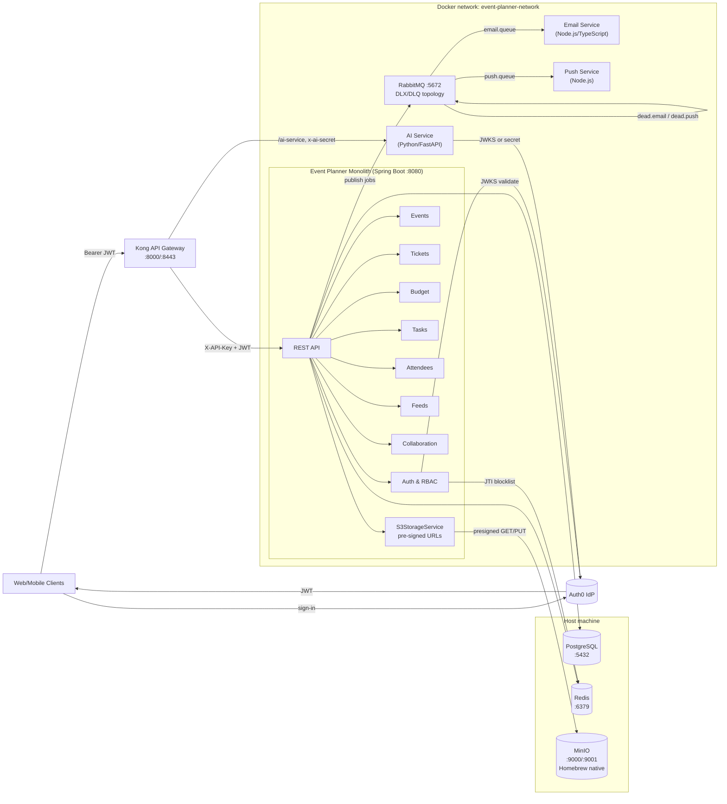

# Architecture

## Overview

The Event Planner backend (**sade-mono**) is a **Java Spring Boot monolith** providing REST APIs for event planning, ticketing, attendees, budgets, timelines, feeds, and notifications. It runs behind **Kong** as the API gateway, with separate microservices for **AI** (Python/FastAPI), **email** (Node.js/Resend), and **push notifications** (Node.js/Firebase). Persistence is **PostgreSQL + PostGIS**; schema is managed by Hibernate DDL (initial) or Flyway migrations. **Redis** is used for caching and JWT revocation. **MinIO** (Homebrew, native on host) provides S3-compatible object storage — all stored objects are accessed exclusively via **pre-signed URLs**. The front end and mobile clients authenticate via **Auth0 OIDC** and send a Bearer JWT on each request.

---

## Tech stack

| Layer | Technology |
|-------|------------|
| Gateway | Kong 3.x (declarative config in `infra/kong/kong.yml`) |
| API | Java 17, Spring Boot 3.3, Spring Security 6, OAuth2 Resource Server (JWT) |
| Auth | OIDC via **Auth0** (issuer, JWKS, audience); migrated from AWS Cognito |
| Database | PostgreSQL + PostGIS extension (Hibernate; Flyway optional) |
| Cache | Redis (Lettuce); JWT revocation blocklist; Caffeine (in-process) |
| Queue | RabbitMQ 3.13 — email and push jobs with **DLX/DLQ** retry topology |
| Storage | **MinIO** (native Homebrew on host, port 9000) — S3-compatible, private buckets, pre-signed URLs |
| RBAC | Custom aspect (`@RequiresPermission`) + YAML policy (`RBAC_policy.yml`); integrity via SHA-256 digest |
| Resilience | Resilience4j circuit breakers + Spring Retry |
| AI | Python FastAPI; OpenAI image generation; Kong gateway secret auth |
| Email | Node.js TypeScript worker (Resend + React Email templates) |
| Push | Node.js worker (Firebase Cloud Messaging) |

---

## Ports and URLs (local development)

| Component | Port(s) | Notes |
|-----------|---------|--------|
| **Kong (proxy)** | 8000 (HTTP), 8443 (HTTPS) | Client-facing; all API traffic should go here |
| **Kong Admin** | 8001 | Bound to `127.0.0.1` only; not published in `docker-compose` |
| **Monolith (Spring Boot)** | 8080 | Internal to Docker network; hot-reload via DevTools |
| **AI service** | 8000 (internal) | Exposed as `/ai-service/` via Kong; path stripped |
| **RabbitMQ** | 5672 (AMQP), 15672 (Management UI) | Management UI bound to `127.0.0.1:15672` only |
| **MinIO** | 9000 (S3 API), 9001 (Console) | **Runs natively on host via Homebrew** (not in Docker) |
| **PostgreSQL** | 5432 | External; on host or managed service |
| **Redis** | 6379 | External; on host or managed service |

- **Client base URL:** `http://localhost:8000` (Kong). Monolith APIs: `/api/v1/`; AI: `/ai-service/`.
- **Direct monolith (dev only):** `http://localhost:8080` — bypasses Kong (service key may still be required).

---

## High-level diagram



---

## Features and modules

- **Auth & users** — Auth0 OIDC JWT validation, auto-provisioning (verified email required), profile, settings, locations, device tokens. Account linking guards: `email_verified` required, ADMIN accounts cannot be linked via OIDC flow. Logout revokes JTI via Redis blocklist (`TokenRevocationService`).
- **Events** — CRUD, status, visibility, access type (open, RSVP, invite-only, ticketed), venue (embedded or linked), reminders, notification settings, stored objects (media), waitlist. Cover images stored in MinIO; pre-signed URLs returned at every read boundary.
- **Collaboration** — Event members (`event_users`), roles (`event_roles`), per-member permissions (`event_user_permissions`), collaborator invites (accepted by POST body token, never query string).
- **Attendees** — Registration, RSVP, check-in, invites. Token delivered in fragment (`#<token>`), accepted via `POST /api/v1/attendees/invites/accept` with body.
- **Tickets** — Ticket types, price tiers, promotions, dependencies, checkouts, issuance, validation (pessimistic write lock prevents TOCTOU race), waitlist, approval requests. Max page size 50.
- **Budget** — One budget per event; categories, line items, revenue tracking.
- **Timeline** — Tasks and checklists.
- **Feeds** — Event posts, comments, likes. Author avatar pre-signed at read boundary.
- **Communications** — Email and push via RabbitMQ DLX/DLQ pattern (max 3 retries, then dead-lettered).
- **AI** — Cover image generation (OpenAI); Kong secret auth with `secrets.compare_digest`; allowlisted SSRF-safe image fetch URLs; image dimensions validated against `ALLOWED_IMAGE_SIZES` whitelist.
- **Object storage** — All media stored as private objects in MinIO. Bare URL stored in DB; `S3StorageService.presignedGetUrlFromBareUrl()` generates time-limited signed URLs at every API read boundary. `mc anonymous` public access is **not** used.

---

## Object storage: MinIO (native Homebrew)

MinIO is **not** in `docker-compose.yml`. It runs directly on the host machine via Homebrew.

```bash
# Install
brew install minio/stable/minio mc

# Start (data dir: ~/minio-data)
minio server ~/minio-data --console-address :9001

# Or as a service
brew services start minio

# Access
#   S3 API:  http://localhost:9000
#   Console: http://localhost:9001
#   Credentials: set MINIO_ROOT_USER / MINIO_ROOT_PASSWORD in .env
```

Buckets are created on first run by the monolith (or manually via Console/mc). Both buckets use **private** access — no public anonymous reads.

```bash
# Create buckets manually (after MinIO is running)
mc alias set local http://localhost:9000 $MINIO_ROOT_USER $MINIO_ROOT_PASSWORD
mc mb local/shade-user-assets
mc mb local/shade-event-assets
# DO NOT run: mc anonymous set download local/<bucket>
```

The Java app connects to MinIO using:
- `AWS_S3_ENDPOINT=http://localhost:9000` (or `http://host.docker.internal:9000` when running in Docker)
- `AWS_S3_PATH_STYLE=true` (required for MinIO path-style URLs)
- `AWS_ACCESS_KEY_ID` / `AWS_SECRET_ACCESS_KEY` = MinIO root credentials

---

## Pre-signed URL pattern

All object storage access uses pre-signed URLs. No object is directly public.

```
Client request
    ↓
API read boundary (e.g. EventService.toResponse())
    ↓
S3StorageService.presignedGetUrlFromBareUrl(BucketAlias, bareUrl, Duration)
    ↓  parses stored URL → strips bucket segment → extracts object key
generatePresignedGetUrl(bucket, key, expiry)
    ↓
Returns time-limited signed URL to client (default: 1 hour)
```

**Applied at all read boundaries:**

| Boundary | File |
|----------|------|
| Event responses (detail + feed) | `EventService.java` |
| Event media (cover image) | `EventMediaService.java` |
| Profile picture URL | `ProfileImageService.java` |
| User account responses | `UserAccountService.java` + `AuthMapper.java` |
| Feed post author avatars | `FeedPostService.java` |
| Comment author avatars | `PostCommentService.java` |
| Follow/follower profile responses | `UserFollowService.java` |

---

## Messaging: RabbitMQ DLX/DLQ topology

```
Monolith (producer)
    │ publish
    ▼
notifications exchange (direct, durable)
    ├─→ [routing: push.notifications] → push.queue (x-dlx: dlx.notifications, x-dlrk: dead.push)
    └─→ [routing: email.notifications] → email.queue (x-dlx: dlx.notifications, x-dlrk: dead.email)
         │ consume                           │ consume
         ▼                                   ▼
   push-service                      email-service
         │ on failure (nack, requeue=false)  │
         └───────────────┬───────────────────┘
                         ▼
               dlx.notifications exchange (direct, durable)
                    ├─→ [dead.push]  → dlq.push  (durable)
                    └─→ [dead.email] → dlq.email (durable)
```

**Retry protocol:**
- Transient errors: republish to main exchange with `x-retry-count` header incremented; max 3 attempts then dead-letter.
- Permanent errors (bad JSON / HTTP 400 validation): dead-letter immediately, no retry.
- Connection errors: `process.exit(1)` → container restarts; reconnect with `RABBITMQ_RECONNECT_MS` delay on graceful close.

See `SECURITY_REVIEW.md` Section 3 for full operational DLQ documentation (inspect/replay commands, alert thresholds).

---

## Request flow

1. **Clients** sign in with Auth0, receive a JWT. Call Kong (`:8000`/`:8443`) with `Authorization: Bearer <token>`.
2. **Kong** strips client-supplied `X-API-Key` / `x-ai-secret`, injects server-side values, applies CORS, request-size limits (50MB), correlation ID (`X-Request-ID`), and security headers. Routes `/` → monolith (8080); `/ai-service/` → AI service (8000 internal).
3. **Monolith** — `ServiceApiKeyFilter` validates `X-API-Key` (always, even when Bearer is present). JWT validated against Auth0 JWKS; `TokenRevocationFilter` checks Redis JTI blocklist before validation. RBAC enforced via `@RequiresPermission` + `RBAC_policy.yml` (SHA-256 integrity checked at startup).
4. **AI service** — Accepts Kong-injected `x-ai-secret` (constant-time compare via `secrets.compare_digest`) or OIDC JWT when secret not configured. Image sizes validated against `ALLOWED_IMAGE_SIZES`. SSRF-safe image fetch (allowlisted hosts only).
5. **Email / push** — Monolith publishes jobs to RabbitMQ exchange. Node workers consume, validate payload, send via Resend/Firebase. DLX handles failures.

---

## Security hardening summary

| Area | Status |
|------|--------|
| Auth0 OIDC (migrated from Cognito) | Active |
| `email_verified` required for auto-provision | Fixed |
| ADMIN block in OIDC provisioning | Fixed |
| JWT revocation (Redis JTI blocklist) | Active |
| API key rotation (primary + secondary) | Active |
| CORS re-enabled with restrictive allowlist | Fixed |
| Swagger restricted to `ROLE_ADMIN`, default off | Fixed |
| Actuator `show-details: when-authorized` | Fixed |
| Email template variable HTML escaping | Fixed |
| Ticket `sortBy` whitelist | Fixed |
| Ticket validation pessimistic write lock | Fixed |
| RBAC policy SHA-256 integrity logging | Active |
| Security headers unconditional (no UA gating) | Fixed |
| MinIO private buckets + pre-signed URLs | Active |
| Non-root USER in all Dockerfiles | Fixed |
| RabbitMQ management UI localhost-only | Fixed |
| DLX/DLQ for email + push workers | Active |
| No default credentials fallbacks | Fixed |
| Resource limits on all containers | Active |
| `python-jose` → `PyJWT[cryptography]` | Fixed |

For the full remediation list, see `SECURITY_REVIEW.md`.

---

## Data flow and persistence

- **Single `application.yml`** — All config in `src/main/resources/application.yml`; overrides via environment variables.
- **Schema** — Hibernate `ddl-auto: update` (or `create` for initial setup). Flyway migrations in `src/main/resources/db/migration/` when active.
- **Domain model** — See [er-diagram.md](er-diagram.md). Main aggregates: users, events, collaboration, attendees, tickets, budget, timeline, feeds, communications.

---

## Resilience and fault tolerance

- **Resilience4j** — Circuit breakers: `notificationService`, `emailService`, `s3Service`. On repeated failures the circuit opens (fast-fail); after wait window moves to half-open.
- **Retry** — Exponential backoff for notification, email, S3 upload; ignores `BadRequestException` and similar non-retryable exceptions.
- **RabbitMQ** — DLX/DLQ topology with `x-retry-count` header (max 3); permanent failures dead-lettered immediately.
- **Database** — HikariCP (max pool 20, min idle 5, timeouts configured).
- **Redis** — Lettuce pool; used for caching (Caffeine fallback) and JWT blocklist.
- **MinIO** — S3StorageService circuit-breaker wrapped; upload/download failures do not cascade to request.

---

## Observability

- **Actuator** (exposed: health, info, metrics, prometheus, circuitbreakers, retry):
  - Health: `/actuator/health` — DB, Redis; `show-details: when-authorized` (requires `ACTUATOR_ADMIN` role).
  - Prometheus: `/actuator/prometheus` — notification and email send metrics.
- **Logging** — RBAC policy SHA-256 digest logged at startup. AI debug content gated by `AI_DEBUG_LOGGING=true`.
- **Kong** — Access/error logs to stdout/stderr; `X-Request-ID` correlation ID propagated.
- **DLQ monitoring** — Alert when `dlq.push.messages > 0` or `dlq.email.messages > 0`.

---

## Deployment

- **Docker Compose** — Runs: monolith (`java-app`), Kong, AI service, email worker, push worker, RabbitMQ. **PostgreSQL, Redis, and MinIO are external** (host machine or managed services).
- **MinIO** — Native Homebrew on host. App container connects via `AWS_S3_ENDPOINT=http://host.docker.internal:9000` when Java runs in Docker.
- **Secrets** — No hardcoded secrets. Use `.env` (from `.env.example`) or a secret manager. Files to never commit: `.env`, `push-service/.env`, `ai-service/.env`, `push-service/cred/`.
- **CORS** — Kong explicit origin allowlist. Set `KONG_CORS_ORIGINS` for production; dev defaults in `kong.yml`.
- **Rate limiting** — Commented out in `kong.yml` (disabled for seeding/dev); enable and tune for production.

---

## Security and configuration

For auth details, RBAC, invite flows, worker validation, environment variables, and hardening, see [security-and-configuration.md](security-and-configuration.md).
