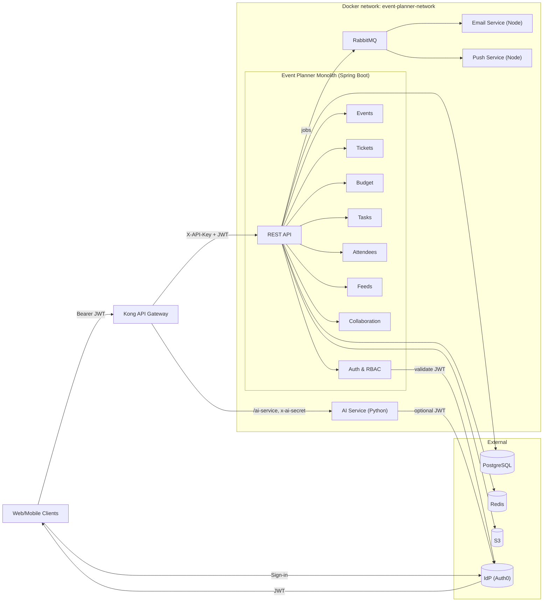

# Architecture

## Overview

The Event Planner backend (sade-mono) is a **Java Spring Boot monolith** that provides REST APIs for event planning, ticketing, attendees, budgets, timelines, feeds, and notifications. It runs behind **Kong** as the API gateway, with separate services for **AI** (Python/FastAPI), **email** (Node/Resend), and **push notifications** (Node/Firebase). Persistence is **PostgreSQL** with **Flyway** for schema migrations; **Redis** is used for caching. The front end and mobile clients authenticate via **OIDC (e.g. Auth0)** and send a Bearer JWT on each request.

## Tech stack

| Layer | Technology |
|-------|------------|
| Gateway | Kong 3.x (declarative config) |
| API | Java 21, Spring Boot 3, Spring Security 6, OAuth2 Resource Server (JWT) |
| Auth | OIDC (e.g. Auth0: issuer, JWKS, audience) |
| Database | PostgreSQL (Hibernate + Flyway; `ddl-auto: validate`) |
| Cache | Redis (Lettuce) |
| Queue | RabbitMQ (email and push jobs) |
| Storage | S3-compatible (event media, user assets) |
| AI | Python FastAPI (OpenAI for cover image generation) |
| Email | Node + Resend (React Email templates) |
| Push | Node + Firebase Cloud Messaging |

## High-level diagram

## Features and modules

- **Auth & users** — OIDC JWT validation, user provisioning, profile, settings, locations, device tokens. Signup requires verified email in the token; account linking rules prevent hijack.
- **Events** — CRUD, status, visibility, access type (open, RSVP, invite-only, ticketed), venue (embedded or linked), reminders, notification settings, stored objects (media), waitlist.
- **Collaboration** — Event members (`event_users`), roles (`event_roles` by role name), per-member permissions (`event_user_permissions`), collaborator invites (accept by token in POST body).
- **Attendees** — Registration, RSVP, check-in, invites. Invite acceptance by token is **POST only** (body); email links use fragment so the token is not in the URL.
- **Tickets** — Ticket types, price tiers, promotions, dependencies, checkouts, issuance, validation, waitlist, approval requests.
- **Budget** — One budget per event, categories, line items, revenue tracking.
- **Timeline** — Tasks and checklists (no separate “timeline” entity); event has timeline publication state.
- **Feeds** — Event posts, comments, likes.
- **Communications** — Email and push via RabbitMQ; templates and payload validation in workers; communication records stored with redacted content.
- **AI** — Cover image generation (OpenAI); gateway secret or JWT; allowlisted image fetch URLs.

## Request flow

1. **Clients** sign in with the IdP (e.g. Auth0) and receive a JWT. They call Kong (e.g. `:8000` or `:8443`) with `Authorization: Bearer <token>`.
2. **Kong** adds the gateway key (`X-API-Key` for the monolith, `x-ai-secret` for the AI service), applies rate limiting and CORS, and routes `/` to the monolith and `/ai-service` to the AI service. Kong Admin (8001) is not exposed by default.
3. **Monolith** — `ServiceApiKeyFilter` ensures either a valid Bearer JWT (user request) or a valid `X-API-Key` (and for internal paths, the key is always required). JWT is validated with OIDC JWKS. RBAC is enforced per endpoint via `@RequiresPermission` and `RBAC_policy.yml`.
4. **AI service** — Accepts requests with a valid gateway secret (constant-time compare) or, when configured, a valid OIDC JWT. Image generation and fetch use allowlisted URLs and timeouts.
5. **Email / push** — Monolith publishes jobs to RabbitMQ; Node workers consume, validate payload (recipient count, lengths, formats), and send. Push batch size is capped (e.g. 500 tokens per message).

## Data flow and persistence

- **Single `application.yml`** — No profile-specific YAML for core behaviour. All config (including `spring.jpa.hibernate.ddl-auto: validate`) is in one place.
- **Schema** — **Flyway** is the only source of DDL. Migrations live under `src/main/resources/db/migration/`. Hibernate does not create or alter tables.
- **Domain model** — See [Entity-relationship diagram](er-diagram.md). Main aggregates: users (`auth_users`, `user_settings`, `locations`), events (`events`, `venues`), collaboration (`event_users`, `event_roles`, `event_user_permissions`, `event_collaborator_invites`), attendees (`attendees`, `attendee_invites`, `attendee_rsvp_history`), tickets (types, checkouts, tickets, waitlist, approval requests), budget (budgets, categories, line items), timeline (tasks, checklists), feeds (event_posts, post_comments, post_likes), and communications (device_tokens, communications).

## Deployment

- **Docker Compose** — Defines the monolith, Kong, AI service, email and push workers, RabbitMQ, and networks. DB, Redis, and S3 are typically external or provided via env.
- **Secrets** — No secrets in the repo. Set `GATEWAY_SERVICE_API_KEY`, `AI_GATEWAY_SHARED_SECRET`, OIDC/Auth0 and DB URLs, etc., via environment or a secret manager. Use `ai-service/.env.example` and `push-service/.env.example` as templates; do not commit `.env` files.
- **CORS** — Kong uses an explicit origin allowlist (no wildcard with credentials). Configure for production accordingly.

## Security and configuration

For auth details, RBAC, invite flows, worker validation, and hardening, see [Security and configuration](security-and-configuration.md).
