# Entity-relationship diagram

This document describes the main domain model and database tables for the Event Planner backend. Schema may be managed by **Flyway** migrations under `src/main/resources/db/migration/`, or by Hibernate DDL for initial setup; when using Flyway, Hibernate is set to `ddl-auto: validate` and does not change the schema.

---

## Diagram

```mermaid
erDiagram
  AUTH_USERS {
    UUID id PK
    string email
    string username
    string auth_sub
    string name
  }

  USER_SETTINGS {
    UUID id PK
    UUID user_id FK
    UUID location_id FK
  }

  USER_PREFERENCES {
    UUID id PK
    UUID user_id FK
    string preference_key
    string value
  }

  LOCATIONS {
    UUID id PK
    string city
    string state
    string country
  }

  VENUES {
    UUID id PK
    string name
    string address
    string city
    string country
  }

  EVENTS {
    UUID id PK
    UUID owner_id FK
    UUID venue_id FK
    UUID timeline_published_by FK
    UUID archived_by FK
    string name
    string event_status
    string access_type
  }

  EVENT_METADATA {
    UUID id PK
    UUID event_id FK
    string metadata_key
    string value
  }

  EVENT_REMINDERS {
    UUID id PK
    UUID event_id FK
  }

  EVENT_NOTIFICATION_SETTINGS {
    UUID id PK
    UUID event_id FK
  }

  EVENT_STORED_OBJECTS {
    UUID id PK
    UUID event_id FK
    UUID uploaded_by FK
  }

  EVENT_WAITLIST_ENTRIES {
    UUID id PK
    UUID event_id FK
    UUID user_id FK
  }

  EVENT_USERS {
    UUID id PK
    UUID event_id FK
    UUID user_id FK
    string user_type
  }

  EVENT_USER_PERMISSIONS {
    UUID id PK
    UUID event_user_id FK
    string permission
  }

  EVENT_ROLES {
    UUID id PK
    UUID event_id FK
    UUID user_id FK
    string role_name
    UUID assigned_by FK
  }

  EVENT_COLLABORATOR_INVITES {
    UUID id PK
    UUID event_id FK
    UUID inviter_user_id FK
    UUID invitee_user_id FK
  }

  CURRENCIES {
    UUID id PK
    string code
  }

  BUDGETS {
    UUID id PK
    UUID event_id FK
    UUID owner_id FK
  }

  BUDGET_CATEGORIES {
    UUID id PK
    UUID budget_id FK
  }

  BUDGET_LINE_ITEMS {
    UUID id PK
    UUID budget_id FK
    UUID budget_category_id FK
  }

  TICKET_TYPES {
    UUID id PK
    UUID event_id FK
  }

  TICKET_TYPE_METADATA {
    UUID id PK
    UUID ticket_type_id FK
    string metadata_key
    string value
  }

  TICKET_PRICE_TIERS {
    UUID id PK
    UUID ticket_type_id FK
    bigint price_minor
  }

  TICKET_TYPE_DEPENDENCIES {
    UUID id PK
    UUID ticket_type_id FK
    UUID required_ticket_type_id FK
  }

  TICKET_PROMOTIONS {
    UUID id PK
    UUID event_id FK
    UUID ticket_type_id FK
  }

  TICKET_TYPE_TEMPLATES {
    UUID id PK
    UUID created_by FK
  }

  TICKET_CHECKOUTS {
    UUID id PK
    UUID event_id FK
    UUID purchaser_id FK
  }

  TICKET_CHECKOUT_ITEMS {
    UUID id PK
    UUID checkout_id FK
    UUID ticket_type_id FK
  }

  TICKETS {
    UUID id PK
    UUID event_id FK
    UUID ticket_type_id FK
    UUID attendee_id FK
    UUID checkout_id FK
  }

  TICKET_METADATA {
    UUID id PK
    UUID ticket_id FK
    string metadata_key
    string value
  }

  TICKET_WAITLIST_ENTRIES {
    UUID id PK
    UUID ticket_type_id FK
    UUID user_id FK
  }

  TICKET_APPROVAL_REQUESTS {
    UUID id PK
    UUID ticket_type_id FK
    UUID user_id FK
  }

  ATTENDEES {
    UUID id PK
    UUID event_id FK
    UUID user_id FK
  }

  ATTENDEE_INVITES {
    UUID id PK
    UUID event_id FK
    UUID inviter_user_id FK
    UUID invitee_user_id FK
  }

  ATTENDEE_RSVP_HISTORY {
    UUID id PK
    UUID event_id FK
    UUID attendee_id FK
    UUID changed_by FK
    string previous_status
    string new_status
  }

  TASKS {
    UUID id PK
    UUID event_id FK
    UUID assigned_to FK
    string title
    string status
  }

  CHECKLISTS {
    UUID id PK
    UUID task_id FK
  }

  EVENT_POSTS {
    UUID id PK
    UUID event_id FK
    UUID created_by FK
  }

  POST_COMMENTS {
    UUID id PK
    UUID post_id FK
    UUID user_id FK
  }

  POST_LIKES {
    UUID id PK
    UUID post_id FK
    UUID user_id FK
  }

  USER_FOLLOWS {
    UUID id PK
    UUID follower_id FK
    UUID following_id FK
  }

  DEVICE_TOKENS {
    UUID id PK
    UUID user_id FK
  }

  COMMUNICATIONS {
    UUID id PK
    UUID event_id FK
  }

  AUTH_USERS ||--|| USER_SETTINGS : has
  LOCATIONS ||--o{ USER_SETTINGS : located_in
  AUTH_USERS ||--o{ USER_PREFERENCES : has

  AUTH_USERS ||--o{ EVENTS : owns
  VENUES ||--o{ EVENTS : venue
  AUTH_USERS ||--o{ EVENTS : timeline_published_by
  AUTH_USERS ||--o{ EVENTS : archived_by
  EVENTS ||--o{ EVENT_METADATA : has
  EVENTS ||--o{ EVENT_REMINDERS : has
  EVENTS ||--|| EVENT_NOTIFICATION_SETTINGS : settings
  EVENTS ||--o{ EVENT_STORED_OBJECTS : media
  AUTH_USERS ||--o{ EVENT_STORED_OBJECTS : uploads
  EVENTS ||--o{ EVENT_WAITLIST_ENTRIES : waitlist
  AUTH_USERS ||--o{ EVENT_WAITLIST_ENTRIES : user

  EVENTS ||--o{ EVENT_USERS : members
  AUTH_USERS ||--o{ EVENT_USERS : user
  EVENT_USERS ||--o{ EVENT_USER_PERMISSIONS : permissions
  EVENTS ||--o{ EVENT_ROLES : roles
  AUTH_USERS ||--o{ EVENT_ROLES : user
  AUTH_USERS ||--o{ EVENT_ROLES : assigned_by
  EVENTS ||--o{ EVENT_COLLABORATOR_INVITES : invites
  AUTH_USERS ||--o{ EVENT_COLLABORATOR_INVITES : inviter
  AUTH_USERS ||--o{ EVENT_COLLABORATOR_INVITES : invitee

  EVENTS ||--|| BUDGETS : budget
  AUTH_USERS ||--o{ BUDGETS : owns
  BUDGETS ||--o{ BUDGET_CATEGORIES : includes
  BUDGETS ||--o{ BUDGET_LINE_ITEMS : includes
  BUDGET_CATEGORIES ||--o{ BUDGET_LINE_ITEMS : contains

  EVENTS ||--o{ TICKET_TYPES : ticket_types
  TICKET_TYPES ||--o{ TICKET_TYPE_METADATA : metadata
  TICKET_TYPES ||--o{ TICKET_PRICE_TIERS : tiers
  TICKET_TYPES ||--o{ TICKET_TYPE_DEPENDENCIES : depends
  TICKET_TYPES ||--o{ TICKET_TYPE_DEPENDENCIES : required
  EVENTS ||--o{ TICKET_PROMOTIONS : promotions
  TICKET_TYPES ||--o{ TICKET_PROMOTIONS : applies_to
  AUTH_USERS ||--o{ TICKET_TYPE_TEMPLATES : creates
  EVENTS ||--o{ TICKET_CHECKOUTS : checkouts
  AUTH_USERS ||--o{ TICKET_CHECKOUTS : purchases
  TICKET_CHECKOUTS ||--o{ TICKET_CHECKOUT_ITEMS : items
  TICKET_TYPES ||--o{ TICKET_CHECKOUT_ITEMS : type
  EVENTS ||--o{ TICKETS : tickets
  TICKET_TYPES ||--o{ TICKETS : type
  ATTENDEES ||--o{ TICKETS : holds
  TICKET_CHECKOUTS ||--o{ TICKETS : produces
  TICKETS ||--o{ TICKET_METADATA : metadata
  TICKET_TYPES ||--o{ TICKET_WAITLIST_ENTRIES : waitlist
  AUTH_USERS ||--o{ TICKET_WAITLIST_ENTRIES : user
  TICKET_TYPES ||--o{ TICKET_APPROVAL_REQUESTS : approval_requests
  AUTH_USERS ||--o{ TICKET_APPROVAL_REQUESTS : user

  EVENTS ||--o{ ATTENDEES : attendees
  AUTH_USERS ||--o{ ATTENDEES : user
  EVENTS ||--o{ ATTENDEE_INVITES : invites
  AUTH_USERS ||--o{ ATTENDEE_INVITES : inviter
  AUTH_USERS ||--o{ ATTENDEE_INVITES : invitee
  EVENTS ||--o{ ATTENDEE_RSVP_HISTORY : rsvp_history
  ATTENDEES ||--o{ ATTENDEE_RSVP_HISTORY : rsvp_history
  AUTH_USERS ||--o{ ATTENDEE_RSVP_HISTORY : changed_by

  EVENTS ||--o{ TASKS : tasks
  AUTH_USERS ||--o{ TASKS : assigned_to
  TASKS ||--o{ CHECKLISTS : checklist

  EVENTS ||--o{ EVENT_POSTS : posts
  AUTH_USERS ||--o{ EVENT_POSTS : creates
  EVENT_POSTS ||--o{ POST_COMMENTS : comments
  AUTH_USERS ||--o{ POST_COMMENTS : user
  EVENT_POSTS ||--o{ POST_LIKES : likes
  AUTH_USERS ||--o{ POST_LIKES : user

  AUTH_USERS ||--o{ USER_FOLLOWS : follower
  AUTH_USERS ||--o{ USER_FOLLOWS : following

  AUTH_USERS ||--o{ DEVICE_TOKENS : devices
  EVENTS ||--o{ COMMUNICATIONS : communications
```

---

## Table and aggregate descriptions

### Auth and users

| Table | Description |
|-------|-------------|
| **auth_users** | Core user identity: `id` (PK), `email`, `username`, `auth_sub` (IdP subject), `name`. One row per user; identity is tied to OIDC and verified email at signup. |
| **user_settings** | Per-user settings: default location, preferences pointer. Links to `auth_users` and optionally `locations`. |
| **user_preferences** | Key-value user preferences (`preference_key`, `value`). |
| **locations** | Reusable location records: `city`, `state`, `country`. Used by user settings and events/venues. |

### Venues and events

| Table | Description |
|-------|-------------|
| **venues** | Standalone venue records: `name`, `address`, `city`, `country`. Events can reference a venue via `venue_id` or store venue data inline. |
| **events** | Main event entity: `owner_id`, optional `venue_id`, `name`, `event_status`, `access_type` (open, RSVP, invite-only, ticketed). Tracks `timeline_published_by`, `archived_by` for lifecycle. |
| **event_metadata** | Key-value extensible metadata per event. |
| **event_reminders** | Reminder definitions for an event. |
| **event_notification_settings** | Per-event notification configuration. |
| **event_stored_objects** | Event media/stored files; `uploaded_by` references user. |
| **event_waitlist_entries** | Waitlist for events (e.g. when capacity or registration is closed). |

### Collaboration

| Table | Description |
|-------|-------------|
| **event_users** | Membership: which users belong to which event; `user_type` distinguishes member kinds. |
| **event_user_permissions** | Per-member permission overrides (granular permissions beyond role). |
| **event_roles** | Role assignment per user per event (`role_name`, e.g. ORGANIZER, COORDINATOR, STAFF); `assigned_by` for audit. |
| **event_collaborator_invites** | Pending collaborator invites: `inviter_user_id`, `invitee_user_id`. Accept/decline via token in POST body. |

### Budget

| Table | Description |
|-------|-------------|
| **currencies** | Currency codes (e.g. USD, EUR). |
| **budgets** | One budget per event; `owner_id` for ownership. |
| **budget_categories** | Categories within a budget. |
| **budget_line_items** | Line items under a category; amounts and metadata. |

### Tickets

| Table | Description |
|-------|-------------|
| **ticket_types** | Ticket type definition per event (name, capacity, etc.). |
| **ticket_type_metadata** | Key-value metadata for a ticket type. |
| **ticket_price_tiers** | Price tiers (`price_minor` for currency minor units). |
| **ticket_type_dependencies** | Required ticket type relationships (e.g. VIP requires General). |
| **ticket_promotions** | Promotions applicable to event or ticket type. |
| **ticket_type_templates** | User-level reusable ticket type templates (not event-scoped). |
| **ticket_checkouts** | Checkout session; `purchaser_id` links to user. |
| **ticket_checkout_items** | Items in a checkout (ticket type + quantity). |
| **tickets** | Issued tickets: link to event, ticket type, attendee, checkout. |
| **ticket_metadata** | Key-value metadata per issued ticket. |
| **ticket_waitlist_entries** | Waitlist for a ticket type. |
| **ticket_approval_requests** | Approval workflow for restricted ticket types. |

### Attendees

| Table | Description |
|-------|-------------|
| **attendees** | Attendance record: event + user (or external guest). |
| **attendee_invites** | Invites sent to users; accept/decline via token in POST body (token in fragment in email links). |
| **attendee_rsvp_history** | History of RSVP status changes; `previous_status`, `new_status`, `changed_by`. |

### Timeline (tasks)

| Table | Description |
|-------|-------------|
| **tasks** | Task entity: event, `assigned_to`, `title`, `status`, ordering. |
| **checklists** | Checklist items belonging to a task. |

### Feeds

| Table | Description |
|-------|-------------|
| **event_posts** | Posts in an event feed; `created_by` user. |
| **post_comments** | Comments on a post. |
| **post_likes** | Likes on a post. |
| **user_follows** | Social graph: follower/following between users. |

### Communications

| Table | Description |
|-------|-------------|
| **device_tokens** | Push notification device tokens per user. |
| **communications** | Audit log of sent communications (email/push); content stored redacted. |

---

## Notes

- **Auth:** Users are in `auth_users` (IdP `sub` in `auth_sub`, email, username). `user_settings` and `locations` support profile and location search. `user_preferences` stores key-value preferences.
- **Events:** `events` has embedded venue fields and optional `venue_id` to a standalone `venues` table. Event metadata is in `event_metadata` (key-value). Access is controlled by `access_type` (open, RSVP, invite-only, ticketed).
- **Collaboration:** `event_users` is the membership table; `event_user_permissions` holds per-member permission overrides; `event_roles` assigns a role name per user per event; `event_collaborator_invites` for invite flow (accept by token in POST body).
- **Tickets:** Types, price tiers, dependencies, promotions, checkouts, and tickets. Waitlist and approval requests live in `ticket_waitlist_entries` and `ticket_approval_requests`. Metadata tables exist for events, ticket types, and tickets.
- **Timeline:** Represented by `tasks` and `checklists`; the event has timeline publication state (e.g. `timeline_published`, `timeline_published_by`). There are no separate `event_timelines` or `timeline_items` tables.
- **Feeds:** `event_posts`, `post_comments`, `post_likes`.
- **Communications:** `device_tokens` for push; `communications` stores send records with redacted content for audit.
- **Identifiers:** Primary keys are UUIDs unless otherwise defined in migrations. Foreign keys follow naming conventions (e.g. `event_id`, `user_id`, `ticket_type_id`).
