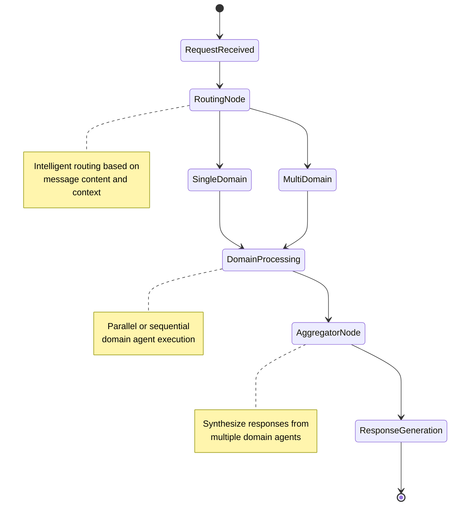
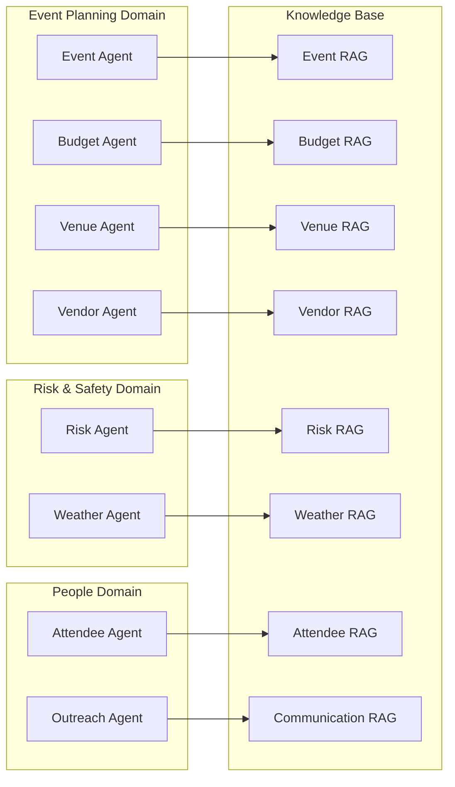
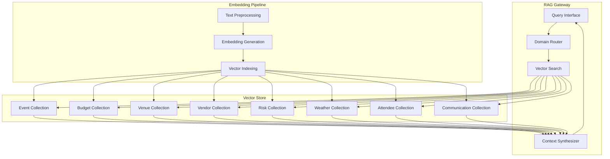
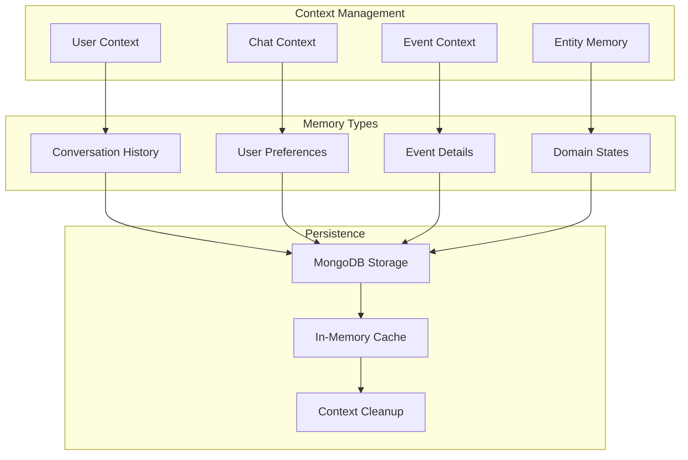
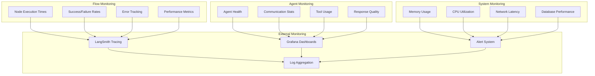
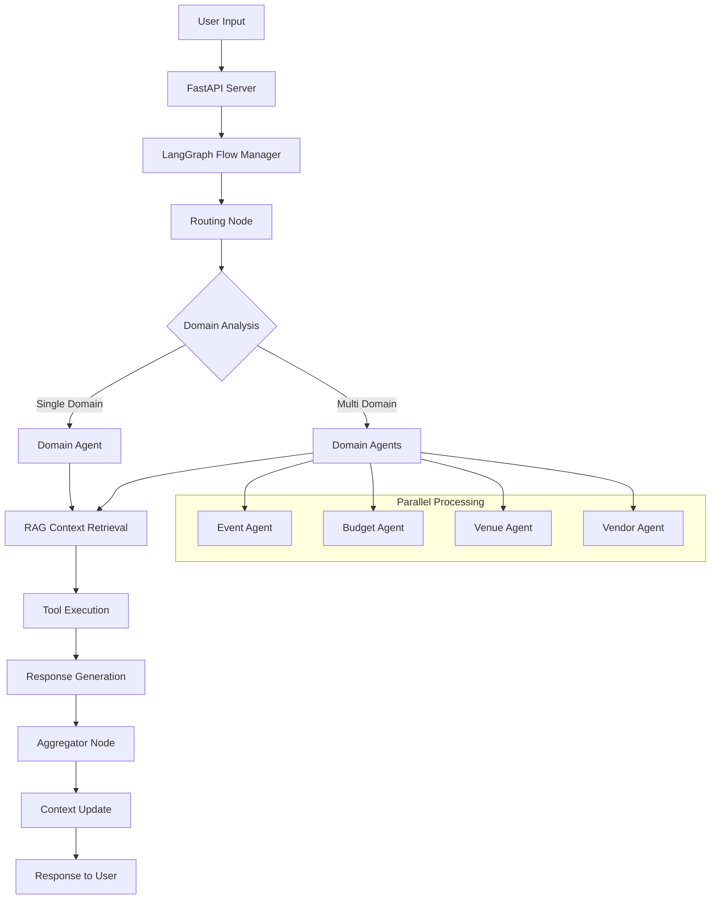
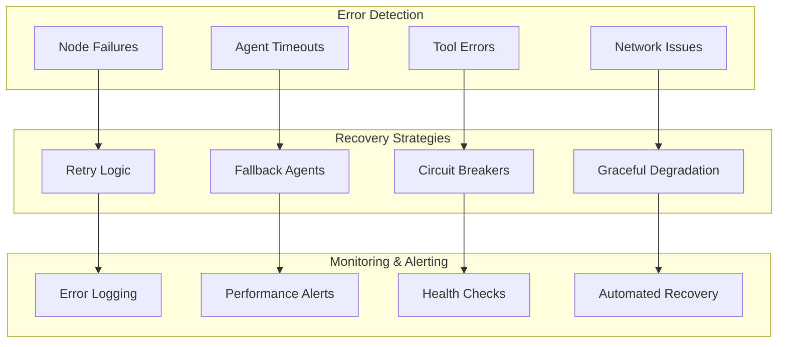
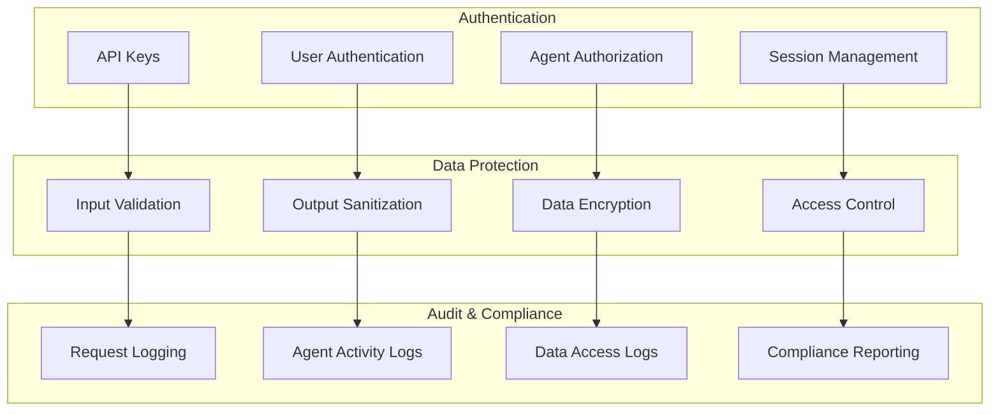
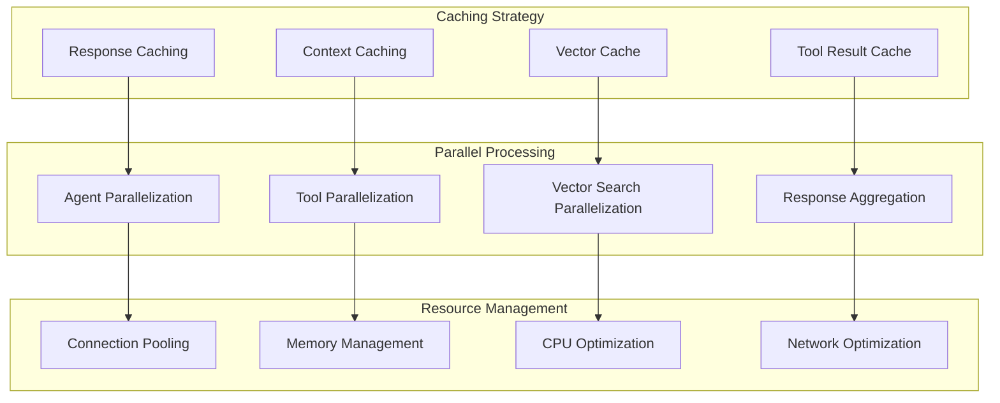

# Shade AI LangGraph Architecture

## Updated System Architecture

```mermaid
graph TB
    subgraph "Client Layer"
        A[Web Browser]
        B[Mobile App]
        C[API Client]
    end
    
    subgraph "API Gateway"
        D[FastAPI Server]
        E[Chat Endpoint /chat]
        F[Dashboard /]
        G[OpenAPI Docs /docs]
    end
    
    subgraph "LangGraph Flow Manager"
        H[Routing Node]
        I[Domain Agents Layer]
        J[Aggregator Node]
        K[Shared Context Memory]
        L[Observability Hooks]
    end
    
    subgraph "Domain Agents"
        M[Event Agent]
        N[Budget Agent]
        O[Venue Agent]
        P[Vendor Agent]
        Q[Risk Agent]
        R[Attendee Agent]
        S[Weather Agent]
        T[Outreach Agent]
    end
    
    subgraph "Knowledge Layer (RAG Gateway)"
        U[Vector DB (Chroma / Pinecone)]
        V[Document Loader + Embedding Pipeline]
    end
    
    subgraph "Toolkits & External APIs"
        W[Google APIs (Gmail, Calendar)]
        X[Weather API]
        Y[Tavily / SerpAPI]
        Z[Payment / Booking APIs]
    end
    
    subgraph "Data Layer"
        DB[MongoDB / PostgreSQL]
        CACHE[Redis / In-memory Cache]
        TASKQ[Async Worker Queue]
    end
    
    subgraph "Monitoring"
        LS[LangSmith / Tracing]
        GF[Grafana / Logs]
    end
    
    A --> D
    B --> D
    C --> D
    D --> H
    H --> I
    I --> M & N & O & P & Q & R & S & T
    M & N & O & P & Q & R & S & T --> U
    U --> DB
    I --> K
    K --> J
    I --> W & X & Y & Z
    J --> D
    H & I & J --> LS
    LS --> GF
    DB --> CACHE
    T --> TASKQ
```

## LangGraph Flow Architecture



## Domain Agent Specialization



## RAG Gateway Architecture



## Shared Context Memory



## Observability & Monitoring



## Data Flow Architecture



## Error Handling & Resilience



## Security Architecture



## Performance Optimization


